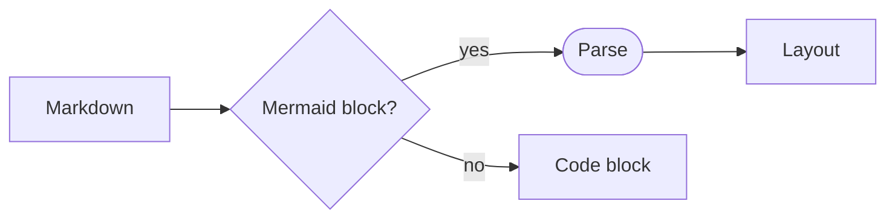

# Text Editing & Markdown

Dear ImGui Bundle includes libraries for syntax-highlighted text editing and markdown rendering.

## rich_md - Markdown Rendering

### Introduction

[imgui_rich_md](https://github.com/pthom/imgui_rich_md) renders markdown content directly in your ImGui interface: headers, emphasis, links, lists, tables, images, code blocks with syntax highlighting, LaTeX math, admonitions and collapsible sections. Its text can be selected with the mouse and copied (Ctrl+C, Cmd+C on macOS); a right click also copies it as markdown. It is a standalone library that also works on stock Dear ImGui (C++); Dear ImGui Bundle includes it, with Python bindings.

In Python the module is `imgui_bundle.rich_md`; in C++ the namespace is `RichMd`. The former names, `imgui_md` (Python) and `ImGuiMd` (C++), remain available as aliases.

**Quick example:**

::::{tab-set}

:::{tab-item} Python
```python
from imgui_bundle import rich_md, immapp

def gui():
    rich_md.render("""
# Hello Markdown

This is **bold** and this is *italic*.

- List item 1
- List item 2
    """)

immapp.run(gui, with_markdown=True)
```

`rich_md.render(s)` removes the common indentation of the string first, so that a string written inside an indented function renders as expected. `rich_md.render_raw(s)` renders it as is.
:::

:::{tab-item} C++
```cpp
#include "immapp/immapp.h"
#include "imgui_rich_md/rich_md.h"

void gui() {
    RichMd::Render(R"(
# Hello Markdown

This is **bold** and this is *italic*.

- List item 1
- List item 2
    )");
}

int main() {
    ImmApp::RunWithMarkdown(gui);
    return 0;
}
```
:::

::::

:::{tip}
Enable markdown by passing `with_markdown=True` to `immapp.run()` (Python) or use `ImmApp::RunWithMarkdown()` (C++).
:::

### Images

rich_md supports images from local assets and from URLs.

**Standard markdown images:**
```markdown


```

**HTML img tags with explicit size:**
```html


```

:::{note}
**Python:** URL images are downloaded asynchronously (a loading spinner is shown while downloading). This works automatically when using `immapp.run(with_markdown=True)`. The download function can be replaced with `rich_md.set_download_function(fn)`.

**C++ (Emscripten):** URL images are downloaded automatically using `emscripten_fetch` (non-blocking, async).

**C++ (desktop):** URL images are not downloaded by default. To enable them, build with `IMGUI_RICHMD_WITH_DOWNLOAD_IMAGES` (libcurl), or set `HostServices::Download` (see `rich_md_host.h`) to a function that downloads data from a URL and returns a `MarkdownDownloadResult` with `Ready`/`Downloading`/`Failed` status.
:::

### LaTeX math

rich_md renders inline and display LaTeX math with [MicroTeX](https://github.com/NanoMichael/MicroTeX) (the bundle uses [a fork](https://github.com/pthom/MicroTeX)).

**Quick example:**

::::{tab-set}

:::{tab-item} Python
```python
from imgui_bundle import rich_md, immapp

def gui():
    rich_md.render(r"""
# Math in markdown

Inline math sits on the text baseline: $E = mc^2$, $\sqrt{a^2 + b^2}$,
$\sum_{i=0}^{n} i = \frac{n(n+1)}{2}$.

Display math is centered on its own line:

$$
x = \frac{-b \pm \sqrt{b^2 - 4ac}}{2a}
$$

Sums, integrals, matrices all work:

$$
\int_{-\infty}^{\infty} e^{-x^2}\, dx = \sqrt{\pi}
\qquad
A = \begin{pmatrix} a & b \\ c & d \end{pmatrix}
\qquad
e^{i\pi} + 1 = 0
$$
    """)

immapp.run(gui, with_latex=True)   # implies with_markdown=True
```

Note the **raw string** (`r"""..."""`): without it, Python would interpret sequences like `\theta` as escape characters and silently corrupt the LaTeX.
:::

:::{tab-item} C++
```cpp
#include "immapp/immapp.h"
#include "imgui_rich_md/rich_md.h"

void gui() {
    RichMd::Render(R"(
# Math in markdown

Inline math: $E = mc^2$, $\sqrt{a^2 + b^2}$.

$$
x = \frac{-b \pm \sqrt{b^2 - 4ac}}{2a}
$$
    )");
}

int main() {
    ImmApp::AddOnsParams addons;
    addons.withLatex = true;        // implies withMarkdown=true
    HelloImGui::SimpleRunnerParams simple;
    simple.guiFunction = gui;
    ImmApp::Run(simple, addons);
    return 0;
}
```
:::

::::

:::{tip}
Enable LaTeX math by passing `with_latex=True` to `immapp.run()` (Python)
or setting `addOnsParams.withLatex = true` (C++). Both imply markdown
support: you do not need to also set `with_markdown=True`.

- When LaTeX is **disabled** (the default), `$` is displayed as a normal character.
- When LaTeX is **enabled**, `$` is treated as math delimiters. To include a literal `$`, escape it like this: `\$`.
:::

:::{note} Pyodide note
Pyodide wheels do not include the math fonts required for rendering LaTeX (to save space, since they occupy about 500KB). They will be downloaded when needed:  the download is triggered by a call to `immapp.run(with_latex=True)`.
:::


### Mermaid diagrams

` ```mermaid ` blocks are drawn natively, with `ImDrawList` and the colors of the ImGui style: flowcharts, sequence diagrams and class diagrams (a subset of Mermaid). A diagram that cannot be parsed is shown as code, with the line of the error.

````markdown

````

To draw a diagram outside of markdown: `rich_md.render_mermaid(source)` (Python), `RichMd::RenderMermaid(source)` (C++). The library's [Mermaid tour](https://pthom.github.io/imgui_rich_md/mermaid.html) shows more of them, and [what is supported](https://github.com/pthom/imgui_rich_md/blob/main/docs/mermaid.md) lists the syntax it reads and how its layout differs from mermaid.js.

### Narrative programming

A program can tell its own story. Its comments and strings hold named markdown sections (`::md Name`) and code regions (`::code`), and markdown transcludes them with an embed alone on its line, as in Obsidian: `![[#Square]]` for the prose of a section, `![[#Square#code]]` for its code, `![[other_file.py#Name]]` for another file. The story chooses its order; the program keeps its own.

::::{tab-set}

:::{tab-item} Python
```python
from imgui_bundle import immapp, rich_md

r"""::md Intro
# A program that tells its own story
The story picks the parts of the file it needs, in its own order:
![[#Square]]
![[#Square#code]]
"""

# ::md Square
# The square of a number, $x^2$:
# ::code
def square(x: float) -> float:
    return x * x
# ::endcode


def gui() -> None:
    rich_md.render_this_file("Intro")


immapp.run(gui, with_latex=True)
```
:::

:::{tab-item} C++
```cpp
#include "immapp/immapp.h"
#include "imgui_rich_md/rich_md.h"

/*::md Intro
# A program that tells its own story
The story picks the parts of the file it needs, in its own order:
![[#Square]]
![[#Square#code]]
*/

// ::md Square
// The square of a number, $x^2$:
// ::code
float Square(float x) { return x * x; }
// ::endcode

void Gui() { RICHMD_RENDER_THIS_FILE("Intro"); }

int main() {
    ImmApp::AddOnsParams addons;
    addons.withLatex = true;
    HelloImGui::SimpleRunnerParams simple;
    simple.guiFunction = Gui;
    ImmApp::Run(simple, addons);
    return 0;
}
```

`RICHMD_RENDER_THIS_FILE` reads the source file (`__FILE__`) at run time: the source must be present where the program runs.
:::

::::

`render_this_file("Intro")` renders the section `Intro` of the calling file, its transclusions resolved. A section written in line comments ends with its code (`::endcode`), or with `::endmd` when it has none; a section in a string or a block comment ends with it.

Example: [the Mandelbrot set as a map of Julia sets](https://imgui-bundle.pages.dev/playground/?demo=explorables/julia_map.py), an interactive lesson in a single Python file ([source](https://github.com/pthom/imgui_bundle/blob/main/bindings/imgui_bundle/demos_python/playground/examples/explorables/julia_map.py)). The idea: [narrative programming](https://github.com/pthom/imgui_rich_md/blob/main/docs/narrative_programming/narrative_programming.md); the syntax in full: [specification](https://github.com/pthom/imgui_rich_md/blob/main/docs/narrative_programming/narrative_programming_spec.md).

### Full Demo

[Try online](https://imgui-bundle.pages.dev/explorer/demo_imgui_md.html) | [Python](https://github.com/pthom/imgui_bundle/blob/main/bindings/imgui_bundle/demos_python/demo_imgui_md.py) | [C++](https://github.com/pthom/imgui_bundle/blob/main/bindings/imgui_bundle/demos_cpp/demo_imgui_md.cpp)

The library's own examples, on stock Dear ImGui (C++): a tour of every feature, an editor, a custom host, fonts. [Try online](https://pthom.github.io/imgui_rich_md/) | [C++](https://github.com/pthom/imgui_rich_md/tree/main/examples)

### Documented APIs

- **Python:** [rich_md.pyi](https://github.com/pthom/imgui_bundle/blob/main/bindings/imgui_bundle/rich_md.pyi)
- **C++:** [rich_md.h](https://github.com/pthom/imgui_rich_md/blob/main/imgui_rich_md/rich_md.h) (and [rich_md_host.h](https://github.com/pthom/imgui_rich_md/blob/main/imgui_rich_md/rich_md_host.h) to plug your own textures, assets or downloads)


## ImGuiColorTextEdit - Syntax Highlighting Editor & Diff Viewer

### Introduction

[ImGuiColorTextEdit](https://github.com/goossens/ImGuiColorTextEdit) is a syntax highlighting text editor and diff viewer for ImGui (originally by BalazsJako, rewritten from scratch by Johan A. Goossens).

Dear ImGui Bundle uses a [fork](https://github.com/pthom/ImGuiColorTextEdit/tree/imgui_bundle) with a few additions for Python bindings.

**Features:**
- Syntax highlighting for C, C++, Python, GLSL, HLSL, Lua, SQL, AngelScript, C#, JSON, Markdown
- Multiple color palettes (dark, light)
- Find/replace UI with keyboard shortcuts
- Text markers (colored line highlights with tooltips)
- Bracket matching with visual indicators
- Line decorators (custom gutter content per line, e.g. breakpoints)
- Context menu callbacks (separate for line numbers and text area)
- Change and transaction callbacks
- Filter selections/lines (transform text via callbacks)
- Autocomplete framework
- Undo/redo, copy/paste, multi-cursor support
- **TextDiff widget**: combined and side-by-side diff view for comparing two texts

:::{tip}
The text editor requires a fixed-width font. If you are using ImmApp with Markdown enabled, you may use its code font:

```python
code_font = rich_md.get_code_font()
imgui.push_font(code_font.font, code_font.size)
editor.render("Code")
imgui.pop_font()
```
:::

### Full Demo

[Try online](https://imgui-bundle.pages.dev/explorer/demo_text_edit.html) | [Python](https://github.com/pthom/imgui_bundle/blob/main/bindings/imgui_bundle/demos_python/demo_text_edit.py) | [C++](https://github.com/pthom/imgui_bundle/blob/main/bindings/imgui_bundle/demos_cpp/demo_text_edit.cpp)

### Documented APIs

- **Python:** [imgui_color_text_edit.pyi](https://github.com/pthom/imgui_bundle/blob/main/bindings/imgui_bundle/imgui_color_text_edit.pyi)
- **C++:** [TextEditor.h](https://github.com/pthom/ImGuiColorTextEdit/blob/imgui_bundle/TextEditor.h) | [TextDiff.h](https://github.com/pthom/ImGuiColorTextEdit/blob/imgui_bundle/TextDiff.h)