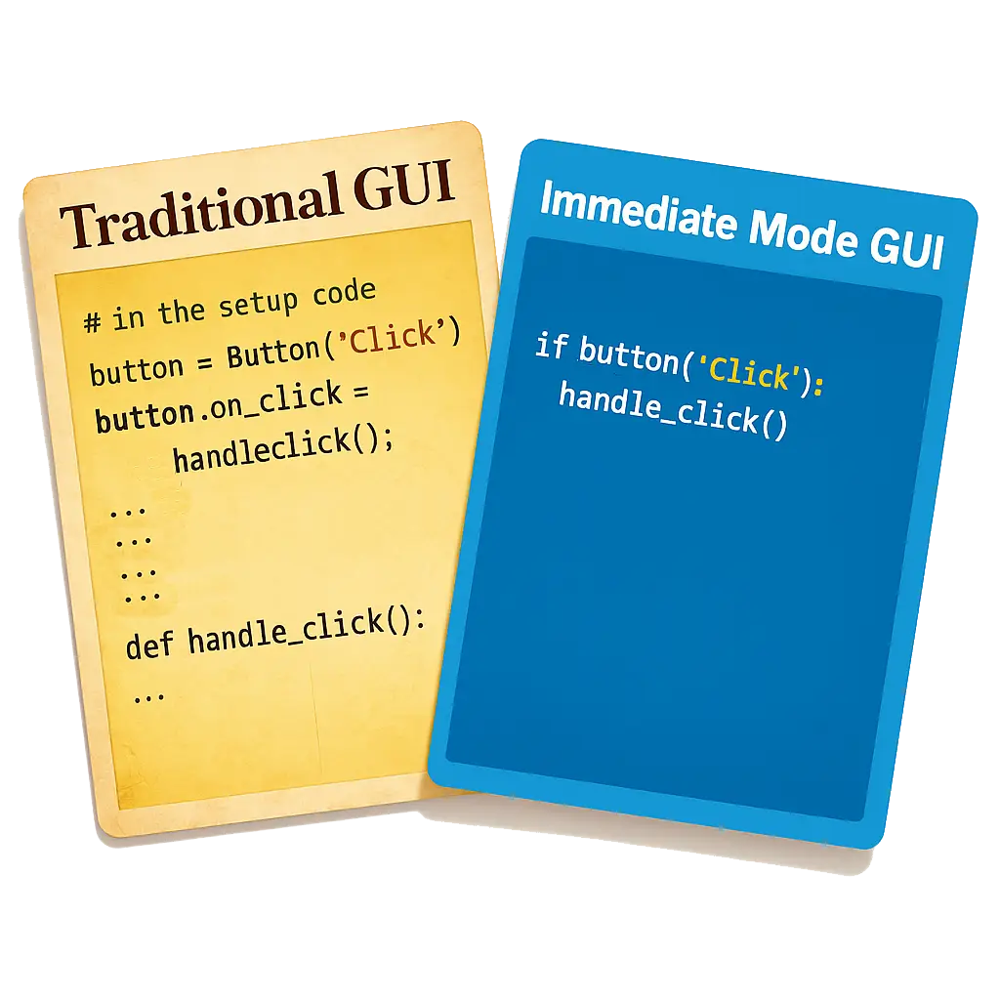
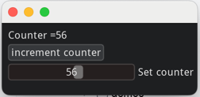
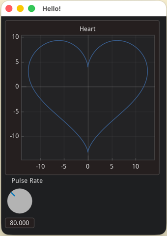

# Immediate GUI

# What is an Immediate GUI



An "Immediate Mode Graphical User Interface" lets you build user interfaces directly in code.
This keeps the UI and app state in perfect sync with minimal boilerplate. This approach is especially popular for quick prototyping and tools because it's intuitive, flexible, easy to maintain, and trivial to debug.

The example below shows a documented example to explain the Immediate Mode GUI paradigm:

::::{tab-set}

:::{tab-item} Python
```python
from imgui_bundle import imgui, immapp

counter = 0 # our app state

# The gui() function is called every frame, so the UI updates in real time.
def gui():
    global counter

    # The state of the UI is always in sync with the app state,
    # via standard variables: debugging UI becomes trivial!
    imgui.text(f"Counter ={counter}")

    # We can display a button, and handle its action in one line:
    if imgui.button("increment counter"):
        counter += 1
    # Below, we can also set the counter value via a slider between 0 and 100
    value_changed, counter = imgui.slider_int("Set counter", counter, 0, 100)

# Run the app (in one line!)
immapp.run(gui)
```
:::

:::{tab-item} C++
```cpp
#include "immapp/immapp.h"
#include "imgui.h"

int counter = 0; // our app state

// The gui() function is called every frame, so the UI updates in real time.
void gui()
{
    // The state of the UI is always in sync with the app state,
    // via standard variables: debugging UI becomes trivial!
    ImGui::Text("Counter =%d", counter);

    // We can display a button, and handle its action in one line:
    if (ImGui::Button("increment counter"))
        counter += 1;
    // Below, we can also set the counter value via a slider between 0 and 100
    ImGui::SliderInt("Set counter", &counter, 0, 100);
}

// Run the app (in one line!)
int main(int, char **) { ImmApp::Run(gui); }
```
:::

::::

It produces this simple app:




**Immediate Mode GUI does not mean that you cannot separate concerns!**

You can still (and should) maintain a separate application state. The key difference is that your GUI can interact directly with that state in a straightforward way, without the need to maintain a separate UI state or complex event handling systems.

# Dear ImGui

The most popular Immediate Mode GUI library is [Dear ImGui](https://github.com/ocornut/imgui), a powerful **C++** library originally created for real-time tools in game engines, now widely used in many industries, with over 60k stars on GitHub.

Dear ImGui Bundle includes Dear ImGui plus many extra libraries, making it ideal for rapid prototyping as well as building complex apps with advanced widgets, plotting, node editors; in C++ and Python.


# Get started in no time with Hello ImGui and ImmApp

With Hello ImGui and ImmApp (both included in Dear ImGui Bundle), you can create a full-featured GUI application with just a few lines of code.

* [Hello ImGui](https://pthom.github.io/hello_imgui) is a library based on ImGui that enables to easily create applications with ImGui. It handles window creation, backend initialization (SDL, GLFW, etc.), cross-platform assets, docking layout, and more.

* [ImApp](https://github.com/pthom/imgui_bundle/blob/main/external/immapp/immapp/runner.h) (aka "Immediate App", a submodule of ImGuiBundle) is a thin extension of Hello ImGui that enables to easily initialize the ImGuiBundle addons that require additional setup at startup.


## Hello World in 4 lines

4 lines are enough to start a GUI application!
::::{tab-set}
:::{tab-item} Python
```python
from imgui_bundle import imgui, immapp

def gui():
    imgui.text("Hello, world!")
immapp.run(gui)
```
:::
:::{tab-item} C++
```cpp
#include "immapp/immapp.h"
#include "imgui.h"

void gui() { ImGui::Text("Hello, world!"); }
int main() { ImmApp::Run(gui); }
```
:::
::::

## A more complete example with plots

The example below shows how to create a more complete application that uses an add-on (ImPlot) for plotting data.

::::{tab-set}
:::{tab-item} Python
```python
import time
import numpy as np

from imgui_bundle import implot, imgui, immapp, imgui_knobs

# Fill x and y whose plot is a heart
vals = np.arange(0, np.pi * 2, 0.01)
x = np.power(np.sin(vals), 3) * 16
y = 13 * np.cos(vals) - 5 * np.cos(2 * vals) - 2 * np.cos(3 * vals) - np.cos(4 * vals)
# Heart pulse rate and time tracking
phase = 0.0
t0 = time.time() + 0.2
heart_pulse_rate = 80


def gui():
    global heart_pulse_rate, phase, t0, x, y

    # Change heart size over time, according to the pulse rate
    t = time.time()
    phase += (t - t0) * heart_pulse_rate / (np.pi * 2)
    k = 0.8 + 0.1 * np.cos(phase)
    t0 = t

    # Plot the heart
    if implot.begin_plot("Heart", immapp.em_to_vec2(21, 21)):
        implot.plot_line("", x * k, y * k)
        implot.end_plot()

    # let the user set the pulse rate via a knob
    _, heart_pulse_rate = imgui_knobs.knob("Pulse Rate", heart_pulse_rate, 30.0, 180.0)


if __name__ == "__main__":
    immapp.run(gui,
               window_size_auto=True,
               window_title="Hello!",
               with_implot=True,
               fps_idle=0  # Make sure that the animation is smooth (do not limit fps when idle)
               )
```
:::
:::{tab-item} C++
```cpp
#include "imgui.h"
#include "implot/implot.h"
#include "imgui-knobs/imgui-knobs.h"
#include "immapp/immapp.h"
#include "hello_imgui/hello_imgui.h"

#include <cmath>

std::vector<double> VectorTimesK(const std::vector<double>& values, double k)
{
    std::vector<double> r(values.size(), 0.);
    for (size_t i = 0; i < values.size(); ++i)
        r[i] = k * values[i];
    return r;
}

int main(int , char *[]) {
    // Fill x and y whose plot is a heart
    double pi = 3.1415926535;
    std::vector<double>  x, y; {
        for (double t = 0.; t < pi * 2.; t += 0.01) {
            x.push_back(pow(sin(t), 3.) * 16.);
            y.push_back(13. * cos(t) - 5 * cos(2. * t) - 2 * cos(3. * t) - cos(4. * t));
        }
    }
    // Heart pulse rate and time tracking
    double phase = 0., t0 = ImmApp::ClockSeconds() + 0.2;
    float heart_pulse_rate = 80.;

    auto gui = [&]() {
        // Change heart size over time, according to the pulse rate
        double t = ImmApp::ClockSeconds();
        phase += (t - t0) * (double)heart_pulse_rate / (pi * 2.);
        double k = 0.8 + 0.1 * cos(phase);
        t0 = t;
        auto xk = VectorTimesK(x, k), yk = VectorTimesK(y, k);

        // Plot the heart
        if (ImPlot::BeginPlot("Heart", ImmApp::EmToVec2(21, 21)))
        {
            ImPlot::PlotLine("", xk.data(), yk.data(), (int)xk.size());
            ImPlot::EndPlot();
        }

        // let the user set the pulse rate via a knob
        ImGuiKnobs::Knob("Pulse", &heart_pulse_rate, 30., 180.);
    };

    ImmApp::AddOnsParams addOnsParams{.withImplot = true};
    HelloImGui::SimpleRunnerParams runnerParams {
        .guiFunction = gui,
        .windowTitle = "Hello!",
        .windowSizeAuto = true,
        .fpsIdle = 0.f // Make sure that the animation is smooth (do not limit fps when idle)
    };
    ImmApp::Run(runnerParams, addOnsParams);
}
```
:::
::::



# Quickly deploy your apps on the web

These apps can be easily deployed on the web, either in C++ via Emscripten, or in Python via Pyodide.

* Online demo (C++/Emscripten): [Heart Pulse Demo](https://traineq.org/ImGuiBundle/emscripten/bin/haiku_implot_heart.html)
* Online demo (Python/Pyodide): [Heart Pulse Demo - Pyodide](https://traineq.org/imgui_bundle_online/projects/min_bundle_pyodide_app/demo_heart.html), and [html + python source code](https://traineq.org/imgui_bundle_online/projects/min_bundle_pyodide_app/demo_heart.source.txt)
