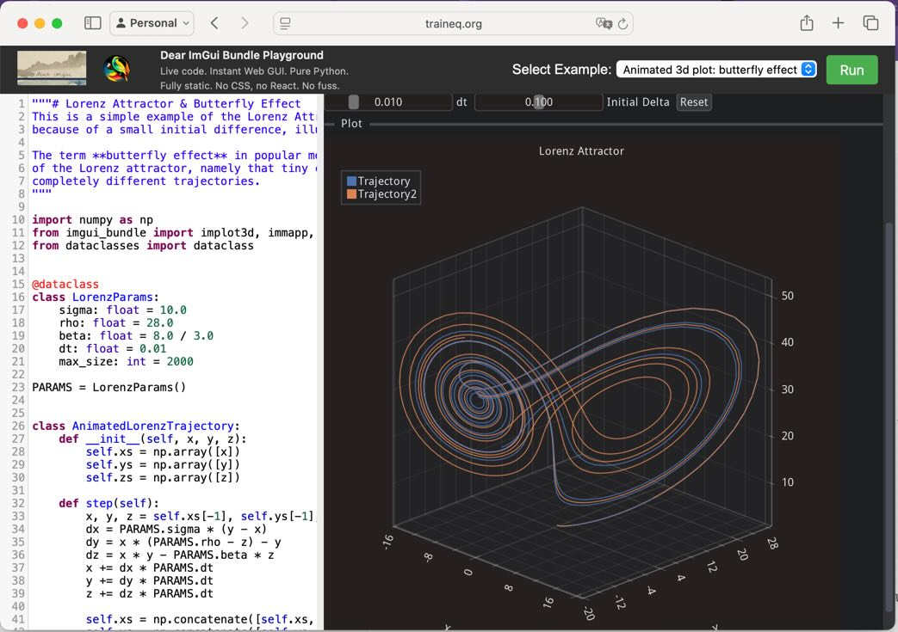

# Interactive Manuals

## Dear ImGui Manual

[Dear ImGui Manual](https://pthom.github.io/imgui_manual_online/manual/imgui_manual.html) lets you explore all the widgets and features of Dear ImGui, with live examples and the corresponding python or C++ code. It is built using Dear ImGui Bundle.

## Dear ImGui Bundle Interactive Manual

[Dear ImGui Bundle interactive manual](https://traineq.org/ImGuiBundle/emscripten/bin/demo_imgui_bundle.html) lets you explore the features of Dear ImGui Bundle in your web browser.

Pay attention to the "Demo Apps" tab, which contains many examples built with Dear ImGui Bundle.
You can read the documentation, run the demos, and even view the source code (in C++ and Python) directly from the manual!

## Online Python playground

With [this online playground](https://traineq.org/imgui_bundle_online/projects/imgui_bundle_playground/), you can edit and run imgui apps in the browser, without installing anything.

