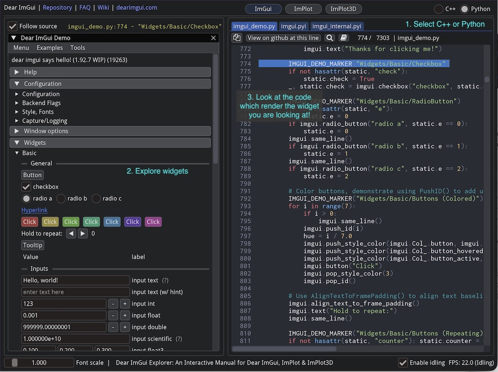
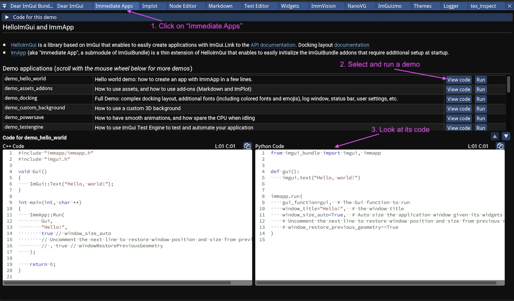
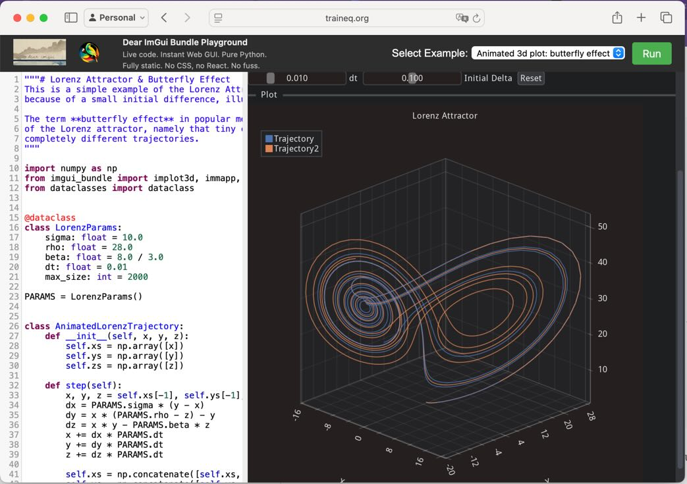

# Interactive Manuals

## Dear ImGui Explorer

[Dear ImGui Manual](https://pthom.github.io/imgui_explorer/) lets you explore all the widgets and features of Dear ImGui, with live examples and the corresponding python or C++ code. It is built using Dear ImGui Bundle.

## Dear ImGui Bundle Explorer

[Dear ImGui Bundle Explorer](https://traineq.org/imgui_bundle_explorer): interactive reference manual - browse demos, see the code, try the widgets.

Each tab provides demos for the included libraries, along with their C++ and Python source code. The "Demo Apps" tab provides sample starter apps from which you can take inspiration.

## Online Python Playground

[Online Python Playground](https://traineq.org/imgui_bundle_online/projects/imgui_bundle_playground/): live Python sandbox with ready-to-run demos - edit code, see results instantly. No installation needed.

