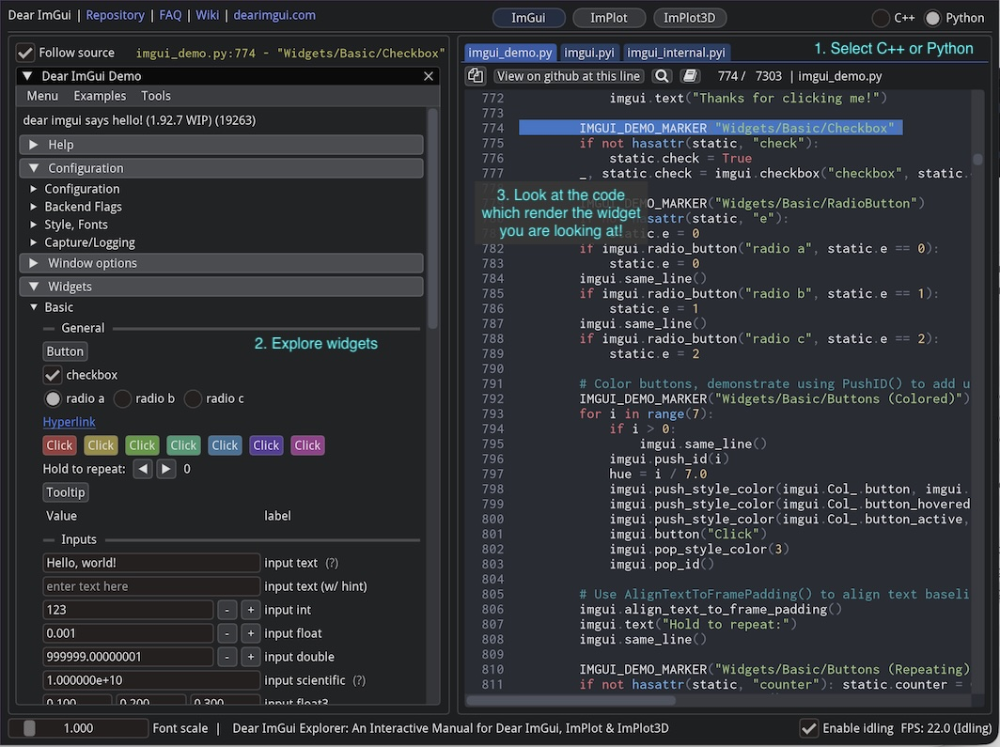
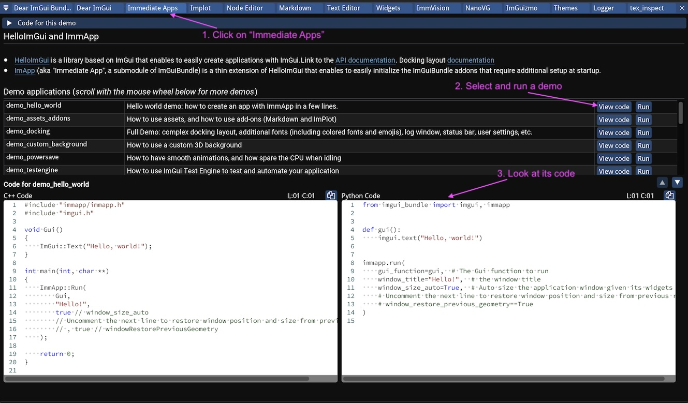
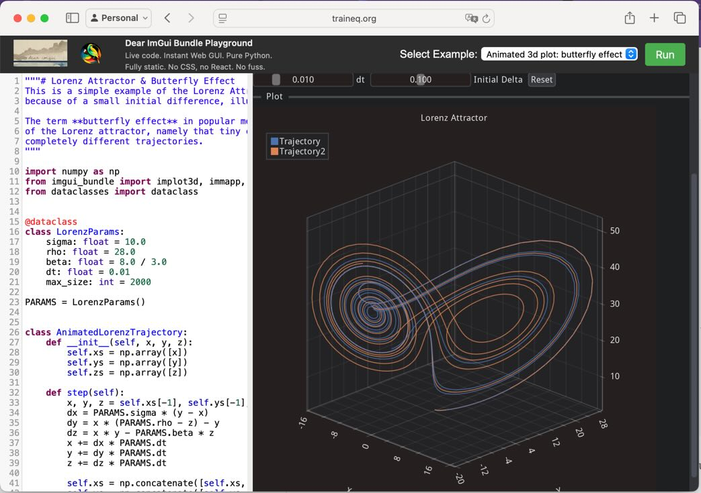

# Interactive Manuals

## Dear ImGui Explorer

[Dear ImGui Explorer](https://pthom.github.io/imgui_explorer/) lets you explore all the widgets and features of Dear ImGui, with live examples and the corresponding python or C++ code. It is built using Dear ImGui Bundle.

Its "API" tab documents the code: click a name in the code, then the book button, and you get its Python and C++ signatures, its doc, where the demo uses it, and links to the [API reference](../api/index.md). A tooltip gives the same for the identifier under the mouse.

## Dear ImGui Bundle Explorer

[Dear ImGui Bundle Explorer](https://imgui-bundle.pages.dev/explorer/): interactive reference manual - browse demos, see the code, try the widgets.

It opens on a welcome page, with a carousel of what the bundle can do. Its "Demos" page is the catalog of demos, by category: starter apps, tours of the libraries, interactive manuals, each with its Python and C++ code.

## Online Python Playground

[Online Python Playground](https://imgui-bundle.pages.dev/playground/): an online Python sandbox with ready-to-run demos - edit code, see results instantly.

