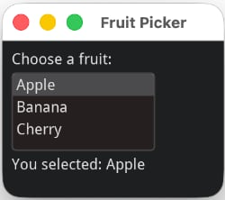

# Dear ImGui Bundle

> From expressive code to powerful GUIs in no time: a fast, feature-rich, cross-platform toolkit for C++ & Python.


_Click the animation below to launch "Dear ImGui Bundle Explorer":_
````{card}
:link: https://traineq.org/imgui_bundle_explorer/
```{figure} ../images/bundle_explorer_vid.*
Dear ImGui Bundle Explorer is an interactive manual with demos of all the features (with example code). It is intended to be used together with this documentation.
```
````

---

## What is Dear ImGui Bundle?

Dear ImGui Bundle is a "batteries included" framework built on [Dear ImGui](https://github.com/ocornut/imgui). It bundles 20+ libraries for plotting, markdown, node editors, 3D gizmos, and more — all working seamlessly in **C++ and Python**, on **all major platforms** (Windows, Linux, macOS, iOS, Android, WebAssembly).

If you are building scientific tools, game tools, visualization applications, developer tools, or creative apps, give it a try.
You'll soon see that GUI code can be clear, readable, and easy to maintain. The immediate mode paradigm makes it a joy to reason about your app logic.


**Key highlights:**

- **Immediate mode**: Your code reads like a book. No widget trees, no callbacks, no synchronization headaches.
- **Cross-platform**: Same code runs on desktop, mobile, and web (via Emscripten or Pyodide).
- **Python-first**: Full Python bindings with type hints and IDE autocompletion.
- **Always up-to-date**: Tracks Dear ImGui upstream closely; Python bindings are auto-generated.


---

## Code That Reads Like a Book

The immediate mode paradigm means your UI code is simple and direct: the app below can be coded with just 9 readable lines of Python:

```python
from imgui_bundle import imgui, hello_imgui

selected_idx = 0
items = ["Apple", "Banana", "Cherry"]

def gui():
    global selected_idx
    imgui.text("Choose a fruit:")
    _, selected_idx = imgui.list_box("##fruits", selected_idx, items)
    imgui.text(f"You selected: {items[selected_idx]}")

hello_imgui.run(gui, window_title="Fruit Picker")
```



The relation between code and behavior is direct: what you write is what runs. There are no hidden widget trees, no callback chains, and no implicit state synchronization. This makes it easier to reason about your app's logic and flow.

**Easy to understand for humans**

Being able to work with readable code is getting more and more important as LLMs are now widely used to generate code: *You*, the human, still need to understand, review, and maintain that code. Immediate mode makes this easier.

**Easy to understand for AI**

And the same clarity that helps humans also helps AI: with no implicit state to get wrong, LLMs can read and generate ImGui code reliably. The [full PDF manuals](https://pthom.github.io/imgui_bundle/assets/book.pdf) give an AI assistant all the context it needs.

:::{tip}
**Try it in your browser — no install needed:** [Open the Online Python Playground](https://traineq.org/imgui_bundle_online/projects/imgui_bundle_playground/)
:::

---

## How Does It Compare?

Not sure if Dear ImGui Bundle is right for you? Compare the code styles with other popular GUI libraries:

::::{tab-set}

:::{tab-item} ImGui Bundle
**12 lines** – True immediate mode: UI declaration *is* the event handler

```python
from imgui_bundle import imgui, hello_imgui

selected_idx = 0
items = ["Apple", "Banana", "Cherry"]

def gui():
    global selected_idx
    imgui.text("Choose a fruit:")
    _changed, selected_idx = imgui.list_box("##fruits", selected_idx, items)
    imgui.text(f"You selected: {items[selected_idx]}")

hello_imgui.run(gui, window_title="Fruit Picker")
```

**Strengths**: Simplest code, real-time capable, runs on desktop + web (Pyodide), 20+ integrated libraries, full C++ support

**Best for**: Tools, visualization, games, scientific apps
:::

:::{tab-item} Qt
**31 lines** – Retained mode with class hierarchy and signals/slots

```python
from PyQt6.QtWidgets import QApplication, QWidget, QVBoxLayout, QLabel, QListWidget

items = ["Apple", "Banana", "Cherry"]

class FruitPicker(QWidget):
    def __init__(self):
        super().__init__()
        layout = QVBoxLayout()
        self.label = QLabel("Choose a fruit:")
        self.list_widget = QListWidget()
        self.list_widget.addItems(items)
        self.result_label = QLabel(f"You selected: {items[0]}")
        self.list_widget.currentRowChanged.connect(self.on_selection_changed)
        layout.addWidget(self.label)
        layout.addWidget(self.list_widget)
        layout.addWidget(self.result_label)
        self.setLayout(layout)

    def on_selection_changed(self, index):
        self.result_label.setText(f"You selected: {items[index]}")

app = QApplication([])
window = FruitPicker()
window.show()
app.exec()
```

**Qt strengths**: More widgets, Qt Designer, larger ecosystem, rich text, accessibility, native look

**ImGui Bundle strengths**: Simpler code, real-time, lighter weight, scientific viz, easier cross-compilation

**Qt is Best for**: Traditional business apps, enterprise software
:::

:::{tab-item} DearPyGui
**29 lines** – ImGui-based but with retained-mode API and callbacks

```python
import dearpygui.dearpygui as dpg

items = ["Apple", "Banana", "Cherry"]
dpg.create_context()

def on_selection_changed(sender, app_data):
    dpg.set_value("result_label", f"You selected: {app_data}")

with dpg.window(tag="Primary Window", label="Fruit Picker"):
    dpg.add_text("Choose a fruit:")
    dpg.add_listbox(items=items, callback=on_selection_changed, num_items=len(items))
    dpg.add_text("You selected: ", tag="result_label")

dpg.create_viewport(title='Fruit Picker', width=400, height=300)
dpg.setup_dearpygui()
dpg.show_viewport()
dpg.set_primary_window("Primary Window", True)
dpg.start_dearpygui()
dpg.destroy_context()
```

**DearPyGui strengths**: Familiar retained-mode API, large user base, good reputation

**ImGui Bundle strengths**: True immediate mode, more libraries (~20), C++ support, Pyodide web support

**DearPyGui is Best for**: Developers who prefer retained-mode patterns
:::

:::{tab-item} NiceGUI
**15 lines** – Web-based with callbacks

```python
from nicegui import ui

selected_idx = -1
items = ["Apple", "Banana", "Cherry"]

def on_selection_change(e):
    global selected_idx
    selected_idx = items.index(e.value)
    selection_label.text = f"You selected: {e.value}"

ui.label("Choose a fruit:")
dropdown = ui.select(options=items, value=items[0], on_change=on_selection_change)
selection_label = ui.label(f"You selected: {items[0]}")

ui.run(title="Fruit Picker")
```

**NiceGUI strengths**: Web-native, modern UI, easy deployment, familiar web paradigm, reactive

**ImGui Bundle strengths**: Native performance, desktop-native, offline capable, advanced widgets, lower latency

**NiceGUI is Best for**: Web-first apps, internal dashboards, CRUD interfaces
:::

:::{tab-item} Gradio
**18 lines** – Declarative blocks with event wiring

```python
import gradio as gr

items = ["Apple", "Banana", "Cherry"]
selected_item = items[0]

def on_selection_change(choice):
    global selected_item
    selected_item = choice
    return f"You selected: {choice}"

with gr.Blocks() as demo:
    gr.Markdown("# Fruit Picker")
    gr.Markdown("Choose a fruit:")
    dropdown = gr.Dropdown(choices=items, value=items[0], label="Choose a fruit")
    output = gr.Textbox(value=f"You selected: {items[0]}", label="Selection", interactive=False)
    dropdown.change(fn=on_selection_change, inputs=dropdown, outputs=output)

demo.launch()
```

**Gradio strengths**: Web-native, ML-focused, Hugging Face integration, easy sharing, pre-built media components

**ImGui Bundle strengths**: Native performance, desktop-native, stateful apps, professional tools, flexibility

**Gradio is Best for**: ML model demos, Hugging Face Spaces, sharing with non-technical users
:::

::::

:::{note}
These examples are [available here](https://github.com/pthom/imgui_bundle/tree/main/bindings/imgui_bundle/demos_python/sandbox/compare_other_libs)
:::

---

## Who is it for?

- **beginners and developers**: go from idea to GUI prototype in minutes, without learning a complex framework. Deploy to almost any platform.
- **ML/AI researchers**: visualize training in real time, tune hyperparameters mid-run, inside Jupyter
- **Computer vision engineers**: inspect images and tensors at the pixel level with ImmVision
- **Robotics developers**: fast, readable debug UIs in Python or C++
- **Scientific instrument builders**: cross-platform GUIs that deploy to desktop and web from the same code
- **Technical tool makers**: build node editors, gizmos, code editors without a web stack


**Who is this project not for**

You should prefer a more complete framework (such as Qt for example) if your intent is to build a fully fledged application, with support for accessibility, internationalization, advanced styling, etc.

---

## Learn More

- **[Key Features](key_features.md)** — Library list, FAQ, and more details.
- **[Immediate Mode Explained](imm_gui.md)** — Understand the paradigm that makes ImGui different.
- **[Interactive Manuals & Demos](interactive_manuals.md)** — Try the demos in your browser.
- **[Jupyter Notebooks](../python/notebook_runners.ipynb)** — Interactive GUIs inside Jupyter. Your training loop keeps running while you tune hyperparameters.

```{include} resources.md
```
