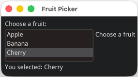

# Why Choose Dear ImGui Bundle?

Dear ImGui Bundle is a mature framework that excels at building technical, real-time, and visualization-heavy applications.

If you are building scientific tools, game tools, visualization applications, developer tools, or creative apps, give it a try. The learning curve is gentle compared to traditional GUI frameworks. Development velocity is high, and the results are professional.

You'll soon see that GUI code can be clear, readable, and easy to maintain. The immediate mode paradigm makes it a joy to reason about your app logic.


:::{note}
* Dear ImGui Bundle may not be the best choice for applications that need to match OS look-and-feel exactly, or for projects where accessibility is critical.
* Being able to work with readable code is getting more and more important as LLMs are now widely used to generate code. Dear ImGui Bundle's immediate mode paradigm naturally leads to code that is easy to understand, both for humans and for AI tools.
:::


# Key Features

## Works everywhere

* **Cross-platform in C++ and Python:** Works on Windows, Linux, macOS, iOS, Android, and WebAssembly!

* **Web ready**: Develop full web applications, in C++ via Emscripten; or in Python thanks to ImGui Bundle's integration within Pyodide.

## First class support for Python

* **Python Bindings:** Using Dear ImGui Bundle in Python is extremely easy and productive.

* **Well documented Python bindings and stubs:** The Python bindings stubs reflect the C++ API and documentation, serving as a reference and aiding autocompletion in your IDE. See for example the [stubs for imgui](https://github.com/pthom/imgui_bundle/blob/main/bindings/imgui_bundle/imgui/__init__.pyi), and [for hello_imgui](https://github.com/pthom/imgui_bundle/blob/main/bindings/imgui_bundle/hello_imgui.pyi).

* Use it to create **standalone apps** (on Windows, macOS, and Linux), or to add **interactive UIs to your notebooks**. Deploy your apps **on the web** with ease, using [Pyodide](https://pyodide.org/en/stable/).

## Easy to use & well documented

* The Immediate Mode GUI (IMGUI) paradigm is simple and powerful, letting you focus on the creative aspects of your projects.

* **Easy to use, yet very powerful:** Start your first app in 3 lines.

* **Interactive Demos and Documentation:** Quickly get started with our interactive manual and demos that showcase the capabilities of the pack. Read or copy-paste the source code (Python and C++) directly from the interactive manual!


## Always up-to-date

* **Always up-to-date:** The libraries are always very close to the latest version of Dear ImGui. This is also true for Python developers, since the bindings are automatically generated.

* **Fast:** Rendering is done via OpenGL (or any other renderer you choose), through native code.

# Comprehensive Library Integration

Dear ImGui Bundle isn't just ImGui - it's a curated ecosystem with more than 20 integrated libraries, where
Each library is:
- Available in Python and C++ with consistent APIs
- Always up to date, since Python bindings are autogenerated
- Documented with interactive examples

### Core Libraries
* <a href="https://github.com/ocornut/imgui">Dear ImGui</a> : Bloat-free Graphical User interface with minimal dependencies
* <a href="https://github.com/ocornut/imgui_test_engine">ImGui Test Engine</a> : Dear ImGui Tests & Automation Engine
* <a href="https://github.com/pthom/hello_imgui">Hello ImGui</a> : cross-platform Gui apps with the simplicity of a "Hello World" app

### Plotting & Visualization
* <a href="https://github.com/epezent/implot">ImPlot</a> : Immediate Mode Plotting
* <a href="https://github.com/brenocq/implot3d">ImPlot3D</a> : Immediate Mode 3D Plotting
* <a href="https://github.com/pthom/immvision">ImmVision</a> : Immediate image debugger and insights
* <a href="https://github.com/andyborrell/imgui_tex_inspect">imgui_tex_inspect</a> : A texture inspector tool for Dear ImGui

### Text Editing & Markdown
* <a href="https://github.com/BalazsJako/ImGuiColorTextEdit">ImGuiColorTextEdit</a> : Colorizing text editor for ImGui
* <a href="https://github.com/mekhontsev/imgui_md">imgui_md</a> : Markdown renderer for Dear ImGui using MD4C parser

### Tools
* <a href="https://github.com/CedricGuillemet/ImGuizmo">ImGuizmo</a> : Immediate mode 3D gizmo for scene editing
* <a href="https://github.com/thedmd/imgui-node-editor">imgui-node-editor</a> : Node Editor built using Dear ImGui
* <a href="https://github.com/memononen/nanovg">NanoVG</a> : Antialiased 2D vector drawing library on top of OpenGL

### Widgets
* <a href="https://github.com/pthom/ImFileDialog">ImFileDialog</a> : A file dialog library for Dear ImGui
* <a href="https://github.com/samhocevar/portable-file-dialogs">portable-file-dialogs</a> : _OS native_ file dialogs library (C++11, single-header)
* <a href="https://github.com/altschuler/imgui-knobs">imgui-knobs</a> : Knobs widgets for ImGui
* <a href="https://github.com/dalerank/imspinner">imspinner</a> : Set of nice spinners for imgui
* <a href="https://github.com/cmdwtf/imgui_toggle">imgui_toggle</a> : A toggle switch widget for Dear ImGui
* <a href="https://github.com/aiekick/ImCoolBar">ImCoolBar</a> : A Cool bar for Dear ImGui
* <a href="https://github.com/hnOsmium0001/imgui-command-palette">imgui-command-palette</a> : A Sublime Text or VSCode style command palette in ImGui


# Quick Code Comparison

## Immediate Mode (Dear ImGui Bundle) 

Unlike many "GUI frameworks," Dear ImGui Bundle embraces the **immediate mode** paradigm.
The code reads like a book:

```python
from imgui_bundle import imgui, hello_imgui

selected_idx = -1
items = ["Apple", "Banana", "Cherry"]

def gui():
    global selected_idx
    imgui.text("Choose a fruit:")
    _changed, selected_idx = imgui.list_box("Choose a fruit", selected_idx, items)
    imgui.text(f"You selected: {items[selected_idx]}")

hello_imgui.run(gui, window_title="Fruit Picker")
```



**Characteristics:**
- State lives in your code (`selected_idx` variable)
- Logic and UI are together (easy to reason about)
- No widget objects to manage
- Changes are immediate

## vs Retained Mode (Qt)

Qt uses a **retained mode** paradigm. 
The code is a bit more involved, as you need to set up a widget tree and manage signals/slots.
The code for the same application would look like this:

```python
from PyQt6.QtWidgets import QApplication, QWidget, QVBoxLayout, QLabel, QListWidget

selected_idx = 0
items = ["Apple", "Banana", "Cherry"]

class FruitPicker(QWidget):
    def __init__(self):
        super().__init__()
        layout = QVBoxLayout()

        self.label = QLabel("Choose a fruit:")
        self.list_widget = QListWidget()
        self.list_widget.addItems(items)
        self.result_label = QLabel(f"You selected: {items[selected_idx]}")

        self.list_widget.currentRowChanged.connect(self.on_selection_changed)

        layout.addWidget(self.label)
        layout.addWidget(self.list_widget)
        layout.addWidget(self.result_label)
        self.setLayout(layout)

    def on_selection_changed(self, index):
        global selected_idx
        selected_idx = index
        self.result_label.setText(f"You selected: {items[selected_idx]}")

app = QApplication([])
window = FruitPicker()
window.show()
app.exec()
```

**Trade-offs:**
- More boilerplate (widget tree, signals/slots)
- State can live in widgets or your code (synchronization needed, via signals)
- Steeper learning curve
- More powerful for complex traditional UIs


# Common Questions

## Is It Interesting for Developers?

**Absolutely yes**, for several reasons:

### 1. Joy of Use

The immediate-mode paradigm is genuinely refreshing:

```python
# Your code directly expresses intent
if imgui.button("Click Me"):
    do_something()
```

This is more readable and maintainable than callback spaghetti or complex widget trees.


### 2. Rapid Development

From zero to functional UI is remarkably fast:
- No UI designer needed
- No XML/JSON layouts to maintain
- Changes appear immediately
- Easy to iterate

### 3. Power When You Need It

The framework scales from simple to complex:
- Start with a simple window and buttons
- Add docking and multiple windows
- Incorporate 3D visualization
- Build node-based editors
- Create custom widgets

All while maintaining code clarity.

### 4. Cross-Platform Reality

The cross-platform support actually works:
- Same code runs on Windows, macOS, Linux
- WebAssembly with Python runtime (!!)
- No platform-specific hacks needed
- Mobile support (iOS, Android) is real (in C++)

### 5. Active Community

- Dear ImGui itself has 70k+ stars and is used in AAA games
- Dear ImGui Bundle is based on Dear ImGui and adds comprehensive Python support
- 1k+ stars
- Regular updates and maintenance, keeping up with Dear ImGui upstream


## "Isn't rebuilding the UI every frame slow?"

**No!** Because:
- Widget calls are cheap (just generate drawing commands)
- Actual rendering is GPU-accelerated
- Typical frame times: < 1ms for most UIs
- Easily achieves 60+ FPS even with complex interfaces

## "How's the Python performance?"

**Excellent!** Because:
- Each widget call crosses to C++ once per frame
- Heavy lifting (rendering) is in C++
- Python overhead is < 0.5ms per frame typically
- Real bottleneck is usually your application logic, not the GUI

## "Does it work on the web?"

**Yes, impressively!**
- C++ → Emscripten → WebAssembly
- Python → Pyodide → WebAssembly (!!)
- Full Python runtime in browser
- Native-speed rendering via WebGL
- Check the interactive manual: [traineq.org/ImGuiBundle](https://traineq.org/ImGuiBundle/emscripten/bin/demo_imgui_bundle.html)


# Comparison with Alternatives

## vs. Qt

**Qt advantages:**
- **More widgets**: Extensive widget library for business apps
- **Design tools**: Qt Designer for visual UI creation
- **Larger ecosystem**: More third-party libraries
- **Better text handling**: Rich text, complex layouts
- **Accessibility**: Better screen reader support
- **Native look**: Platform-native appearance

**ImGui Bundle advantages:**
- **Simpler code**: More readable, less boilerplate
- **Better for real-time**: Games, simulations, live data visualization
- **Easier to learn**: Smaller API surface, no MOC/signals/slots complexity
- **Lighter weight**: Smaller binary size, faster compilation
- **Scientific visualization**: ImPlot is excellent
- **Cross-compilation**: Easier for embedded, web
- **Run on desktop and web**, with the same code.

**Example comparison:**
```python
# ImGui Bundle - immediate, clear
if imgui.button("Save"):
    save_file()

# Qt - more ceremonial
save_button = QPushButton("Save")
save_button.clicked.connect(save_file)
layout.addWidget(save_button)
```

**When choosing**: Qt for traditional business apps; ImGui Bundle for tools, visualization, games, scientific apps.


## vs. Streamlit

**Streamlit** is designed for ultra-simple ML/AI dashboards and data apps.

Both Streamlit and ImGui Bundle aim for simplicity, and are great for prototyping with very few lines of code. 

**Different use cases:**
- **Streamlit**: Best for quick data dashboards, ML model demos, sharing data insights
- **ImGui Bundle**: Best for desktop applications, real-time visualization, complex UIs, tools

**ImGui Bundle advantages:**
- **Performance**: Native rendering, real-time capable (games, simulations, live data)
- **Interactivity**: Immediate response, no page reloads, full control over UI flow
- **Desktop-native**: True desktop applications with file access, native dialogs
- **Web**: The same code can run in a browser via Pyodide.
- **Stateful applications**: Natural for complex, long-running applications
- **Professional tools**: Node editors, 3D gizmos, advanced widgets
- **No server required**: Runs entirely locally

**Streamlit advantages:**
- **Web-native**: Built for browser deployment from the start
- **Simplest possible**: Even easier for basic data apps
- **Automatic reactivity**: Re-runs script on widget change
- **Built-in sharing**: Deploy to Streamlit Cloud instantly

**When Choosing**: Streamlit for quick data dashboards and sharing insights; ImGui Bundle for more complex desktop applications (or web via Pyodide) and real-time tools.

## vs. Gradio

**Gradio** is designed for creating ML model interfaces, particularly for Hugging Face integration.

**Different use cases:**
- **Gradio**: Best for ML model demos, Hugging Face Spaces, sharing models with non-technical users
- **ImGui Bundle**: Best for desktop applications, real-time visualization, complex UIs, tools

**ImGui Bundle advantages:**
- **Performance**: Native rendering, real-time capable (games, simulations, live data)
- **Flexibility**: Complete control over layout, styling, interaction
- **Desktop-native**: True desktop applications with file access, native dialogs
- **Web**: The same code can run in a browser via Pyodide.
- **Stateful applications**: Natural for complex, long-running applications
- **Professional tools**: Node editors, 3D gizmos, advanced widgets

**Gradio advantages:**
- **Web-native**: Built for browser deployment from the start
- **ML-focused**: Optimized for model input/output interfaces
- **Hugging Face integration**: First-class Spaces support
- **Easier sharing**: Automatic public URL generation
- **Pre-built components**: Image, audio, video components out of the box

**When Choosing**: Different tools for different jobs. Gradio for ML model sharing; ImGui Bundle for serious desktop applications and real-time tools.


## vs. NiceGUI

**NiceGUI** is a modern web-based GUI framework for Python that creates browser-based interfaces with a clean, component-based API.

**Different use cases:**
- **NiceGUI**: Best for web apps, internal tools, dashboards, and simple browser-based interfaces
- **ImGui Bundle**: Best for desktop applications, real-time visualization, complex UIs, professional tools

**ImGui Bundle advantages:**
- **Performance**: Native rendering, true real-time capability for games, simulations, high-frequency data
- **Desktop-native**: True desktop applications with full file system access, no browser required
- **Web**: The same code can run in a browser via Pyodide.
- **Advanced widgets**: Node editors, 3D gizmos, complex plotting, professional tool widgets
- **Offline**: No server or internet connection needed
- **Lower latency**: Direct rendering without browser/network overhead
- **C++ support**: Full native performance when needed

**NiceGUI advantages:**
- **Web-native**: Built for browser deployment from the start
- **Modern UI**: Clean, contemporary web design out of the box
- **Easier deployment**: Works anywhere with a web browser
- **Familiar web paradigm**: Uses web technologies developers know
- **Reactive**: Built-in reactivity similar to modern web frameworks
- **Easier for CRUD apps**: Better suited for traditional web forms and database interfaces


**When Choosing**: NiceGUI for web-first applications and internal dashboards; ImGui Bundle for desktop applications, real-time tools, and performance-critical visualization.


## vs. DearPyGui

**DearPyGui** is also based on Dear ImGui, but it provides a retained-mode API.

```python
# DearPyGui - retained mode API
with dpg.window(label="Example"):
    dpg.add_button(label="Click", callback=my_callback)

# ImGui Bundle - true immediate mode
if imgui.button("Click"):
    my_callback()
```

**ImGui Bundle advantages:**
- **True immediate mode**: Direct, readable code that expresses intent
- **More libraries**: ImGui Bundle includes ~20 additional libraries (ImPlot, ImGuizmo, node editors, etc.)
- **C++ support**: Full C++ API, not Python-only
- **Pyodide support**: Runs in web browsers with Python
- **Active maintenance**: Regular updates tracking Dear ImGui upstream

**DearPyGui advantages:**
- **Familiar retained-mode API** for developers coming from other frameworks
- **A wide range of libraries**, though a bit less than ImGui Bundle
- DearPyGui can rely on a **large user base** and good **reputation**.
