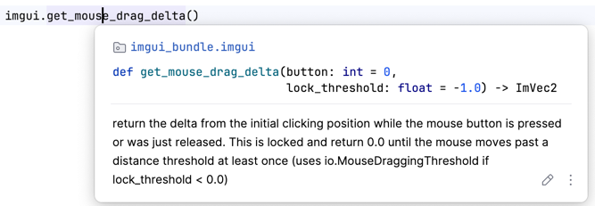
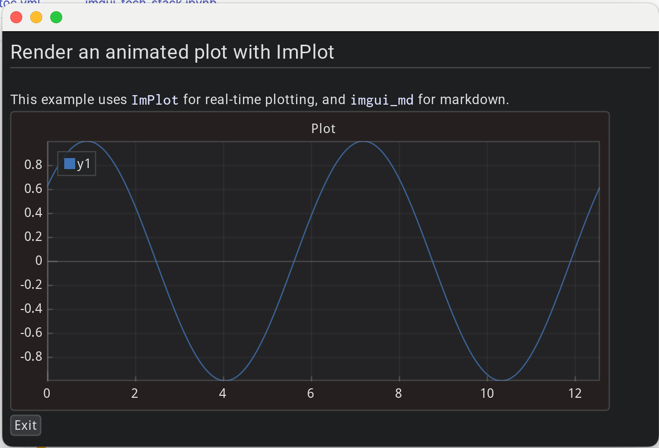

# Introduction


# Immediate GUI in Python with Dear ImGui Bundle

The most popular Immediate Mode GUI library is [Dear ImGui](https://github.com/ocornut/imgui), a powerful **C++** library originally created for real-time tools in game engines, now widely used in many industries, with over 60k stars on GitHub.

For Python, [Dear ImGui Bundle](https://github.com/pthom/imgui_bundle) brings full Dear ImGui support plus many extra libraries, making it ideal for rapid prototyping as well as building complex apps with advanced widgets, plotting, node editors, and more.

The python bindings are heavily documented so that they are easy to browse. They are also autogenerated, so that they are always up-to-date.





# Anatomy of an application with Dear ImGui Bundle

`imgui_bundle` is a Python package that unifies multiple Dear ImGui-related submodules:

* `imgui`: the core Dear ImGui library
* `implot` and `implot3d`: for advanced, real-time plotting
* `imgui_md`: markdown rendering for imgui
* `hello_imgui`: an approachable starter kit for new apps
* `immapp`: helper to activate "addons" (like implot, markdown, etc.)
* Plus about 20 other powerful tools

The example below is heavily commented and shows how to create a simple app that combines Markdown text and an animated plot using `implot`:

```python
import numpy as np
from imgui_bundle import imgui, implot, imgui_md, hello_imgui, immapp

def gui():
    # Render Markdown text
    imgui_md.render_unindented("""
    # Render an animated plot with ImPlot
     This example uses `ImPlot` for real-time plotting, and `imgui_md` for markdown.
    """)

    # Render an animated plot (updates every frame)
    if implot.begin_plot(
            title_id="Plot",
            # size in em units (1em = height of a character)
            size=hello_imgui.em_to_vec2(40, 20)):
        x = np.arange(0, np.pi * 4, 0.01)
        y = np.cos(x + imgui.get_time())
        implot.plot_line("y1", x, y)
        implot.end_plot()

    if imgui.button("Exit"):
        hello_imgui.get_runner_params().app_shall_exit = True

# Run the app with ImPlot and markdown support
immapp.run(gui,
           with_implot=True,
           with_markdown=True,
           window_size=(700, 500))
```



# Deploy your applications

Dear ImGui Bundle apps are highly portable—they can run as standalone Python scripts, in Jupyter notebooks, or even directly in web browsers via Pyodide.

* **Standalone scripts:** Run on any PC (Windows, macOS, Linux) with minimal setup.

* **Jupyter notebooks:** The app runs in a separate window, and a screenshot is displayed in the notebook after closing (requires running Jupyter locally).

* **Web (Pyodide):** No server or installation required—just a static HTML file. Your Python app runs in the browser, with the package downloaded from a CDN.


