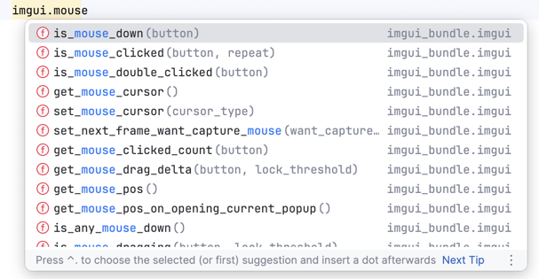
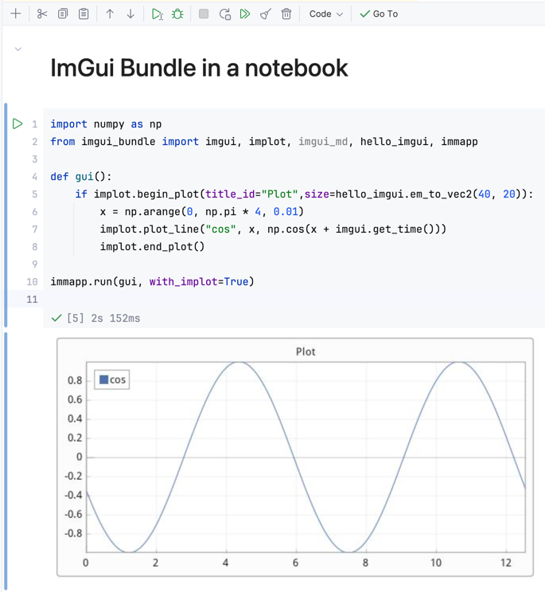
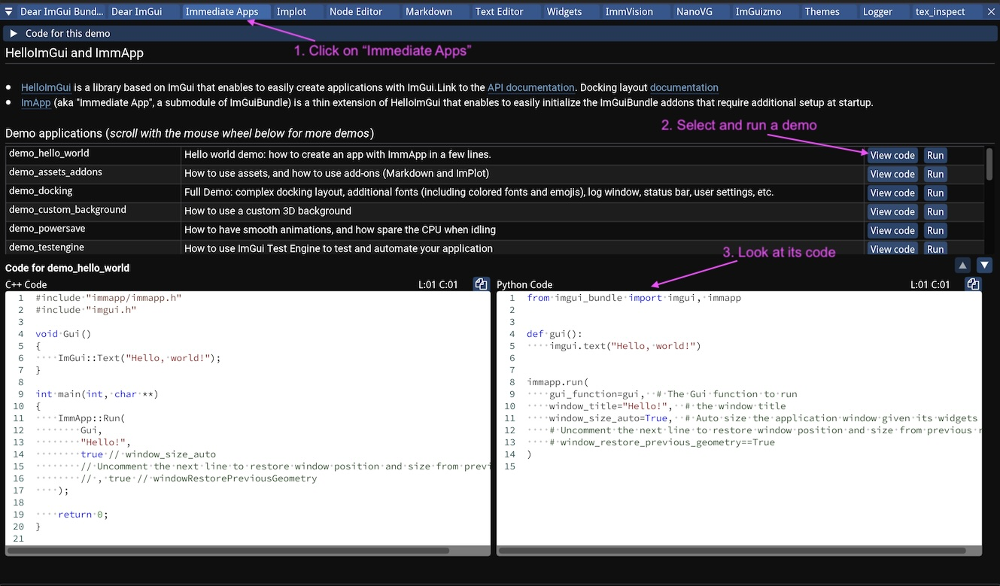
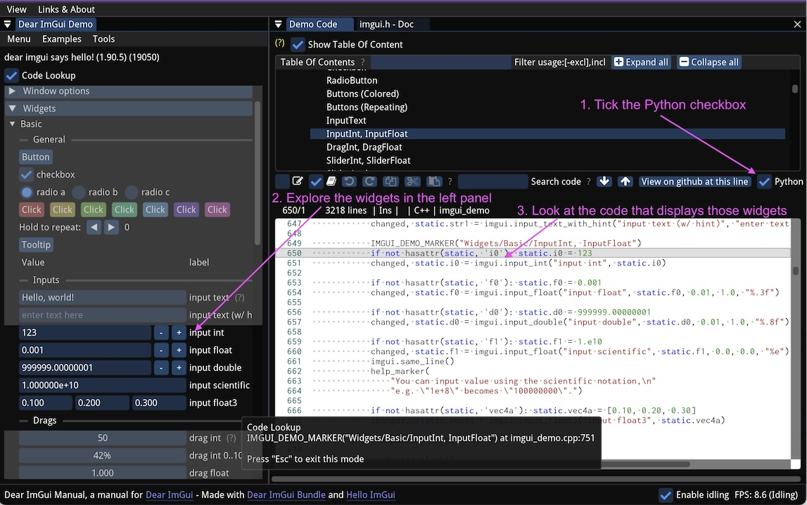

Immediate Mode GUI with Python and Dear ImGui Bundle
====================================================


# What is Immediate Mode GUI?

An "Immediate Mode Graphical User Interface" lets you build user interfaces directly in code.
This keeps the UI and app state in perfect sync with minimal boilerplate. This approach is especially popular for quick prototyping and tools because it's intuitive, flexible, easy to maintain, and trivial to debug.

See the example below:

```python
from imgui_bundle import imgui, immapp

counter = 0 # our app state

# The gui() function is called every frame, so the user interface updates in real time.
def gui():
    global counter

    # The state of the UI is always in sync with the app state (via standard python variables)
    # (debugging UI becomes trivial!)
    imgui.text(f"Counter ={counter}")

    # We can display widgets, and directly update the app state when they are interacted with
    if imgui.button("increment counter"):
        counter += 1  # Here, we increment the counter when the button is clicked
    # Below, we can also directly set the counter value via an slider between 0 and 100
    value_changed, counter = imgui.slider_int("Set counter", counter, 0, 100)


# Run the app (in one line!)
immapp.run(gui)
```

Which produces this simple app:


# Immediate GUI in Python with Dear ImGui Bundle

The most popular Immediate Mode GUI library is [Dear ImGui](https://github.com/ocornut/imgui), a powerful **C++** library originally created for real-time tools in game engines, now widely used in many industries, with over 60k stars on GitHub.

For Python, [Dear ImGui Bundle](https://github.com/pthom/imgui_bundle) brings full Dear ImGui support plus many extra libraries, making it ideal for rapid prototyping as well as building complex apps with advanced widgets, plotting, node editors, and more.

The python bindings are heavily documented so that they are easy to browse. They are also autogenerated, so that they are always up-to-date.




# Anatomy of an application with Dear ImGui Bundle

`imgui_bundle` is a Python package that unifies multiple Dear ImGui-related submodules:

* `imgui`: the core Dear ImGui library
* `implot` and `implot3d`: for advanced, real-time plotting
* `imgui_md`: markdown rendering for imgui
* `hello_imgui`: an approachable starter kit for new apps
* `immapp`: helper to activate "addons" (like implot, markdown, etc.)
* Plus about 20 other powerful tools (see [full list](https://pthom.github.io/imgui_bundle/introduction.html))

The example below is heavily commented and shows how to create a simple app that combines Markdown text and an animated plot using `implot`:

```python
import numpy as np
from imgui_bundle import imgui, implot, imgui_md, hello_imgui, immapp

def gui():
    # Render Markdown text
    imgui_md.render_unindented("""
    # Render an animated plot with ImPlot
     This example uses `ImPlot` for real-time plotting, and `imgui_md` for markdown.
    """)

    # Render an animated plot (updates every frame)
    if implot.begin_plot(
            title_id="Plot",
            # size in em units (1em = height of a character)
            size=hello_imgui.em_to_vec2(40, 20)):
        x = np.arange(0, np.pi * 4, 0.01)
        y = np.cos(x + imgui.get_time())
        implot.plot_line("y1", x, y)
        implot.end_plot()

    if imgui.button("Exit"):
        hello_imgui.get_runner_params().app_shall_exit = True

# Run the app with ImPlot and markdown support
immapp.run(gui,
           with_implot=True,
           with_markdown=True,
           window_size=(700, 500))
```


# Deploy your applications

Dear ImGui Bundle apps are highly portable—they can run as standalone Python scripts, in Jupyter notebooks, or even directly in web browsers via Pyodide.

* **Standalone scripts:** Run on any PC (Windows, macOS, Linux) with minimal setup.

* **Jupyter notebooks:** The app runs in a separate window, and a screenshot is displayed in the notebook after closing (requires running Jupyter locally).

* **Web (Pyodide):** No server or installation required—just a static HTML file. Your Python app runs in the browser, with the package downloaded from a CDN.



**Pyodide Minimal Example**

With Pyodide, web deployment is as easy as copying this HTML template. The Python code is unchanged from what you’d use for desktop.


```html
<!doctype html>
<html>
<head>
    <style>
        html, body { width: 100%; height: 100%; margin: 0; }
        #canvas { display: block; width: 100%; height: 100%;}
    </style>
    <script src="https://cdn.jsdelivr.net/pyodide/v0.28.2/full/pyodide.js"></script>
</head>
<body>
<canvas id="canvas" tabindex="0"></canvas>
<script type="text/javascript">
    // ====================== Start of Python code ============================
    // Write your python code here
    pythonCode = `
from imgui_bundle import imgui, immapp

def gui():
    imgui.text(f"hello, world")

immapp.run(gui)
`
    // ====================== End of Python code ==============================
    async function main(){
        // This enables to use right click in the canvas
        document.addEventListener('contextmenu', event => event.preventDefault());
        // Load Pyodide
        let pyodide = await loadPyodide();
        // Setup SDL, cf https://pyodide.org/en/stable/usage/sdl.html
        let sdl2Canvas = document.getElementById("canvas");
        pyodide.canvas.setCanvas2D(sdl2Canvas);
        pyodide._api._skip_unwind_fatal_error = true; // SDL requires to enable an opt-in flag :
        // Load imgui_bundle
        await pyodide.loadPackage("imgui_bundle");
        // Run the Python code
        pyodide.runPython(pythonCode);
    }
    main();
</script>
</body>
</html>
```

*Link to more advanced example: [animated heart](https://traineq.org/imgui_bundle_online/projects/min_bundle_pyodide_app/demo_heart.html), and [source code](https://traineq.org/imgui_bundle_online/projects/min_bundle_pyodide_app/demo_heart.source.txt)*

This instant browser deployment is a game changer: it lets developers and educators share fully functional GUIs with anyone, anywhere, using only a static HTML page—no installation, servers, or extra setup required.

> **Note:** Pyodide cannot use large native packages (like TensorFlow or PyTorch), and initial loading can be slow.


# Getting Started - Live Examples and Resources

## Live examples

**Browse the API inside your IDE**

The API is heavily documented, so that you can browse it inside your IDE.


**Use ImGui Bundle's interactive manual**

The [ImGui Bundle interactive manual](https://traineq.org/ImGuiBundle/emscripten/bin/demo_imgui_bundle.html) provides lots of example apps which you can run and inspect the source code.



**Use ImGui's interactive Manual**

The [ImGui Manual](https://pthom.github.io/imgui_manual_online/manual/imgui_manual.html) lets you explore all the widgets and features of Dear ImGui, with live examples and the corresponding python or C++ code.



**Online pyodide playground**

With [this online playground](https://traineq.org/imgui_bundle_online/projects/imgui_bundle_playground/), you can edit and run imgui apps in the browser, without installing anything.


## Resources

**Live examples**

- [ImGui Bundle interactive manual](https://traineq.org/ImGuiBundle/emscripten/bin/demo_imgui_bundle.html): lots of example apps which you can run and inspect the source code
- [ImGui Manual (widget reference & code)](https://pthom.github.io/imgui_manual_online/manual/imgui_manual.html): explore all the widgets and features of Dear ImGui, with live examples and the corresponding python or C++ code
- [Online Pyodide playground](https://traineq.org/imgui_bundle_online/projects/imgui_bundle_playground/):  try imgui apps using Python, directly in your browser


**Documentation websites**

- [Dear ImGui Bundle documentation](https://pthom.github.io/imgui_bundle/). Read [this page](https://pthom.github.io/imgui_bundle/python_specific.html) for python-specific information
- [Hello ImGui documentation](https://pthom.github.io/hello_imgui)


**Full PDF manuals for LLMs**

You may feed the manuals below to a LLM, so that it can help you when using the libraries.

- [Hello ImGui manual (full pdf)](https://raw.githubusercontent.com/pthom/imgui_related_docs/refs/heads/main/manuals/hello_imgui_manual.pdf)
- [ImGui Bundle manual (full pdf)](https://raw.githubusercontent.com/pthom/imgui_related_docs/refs/heads/main/manuals/imgui_bundle_manual.pdf)
- [Fiatlight manual (full pdf)](https://pthom.github.io/fiatlight_doc/flgt.pdf)


**Repositories**

- [Dear ImGui official repository](https://github.com/ocornut/imgui)
- [Dear ImGui Bundle repository](https://github.com/pthom/imgui_bundle)
- [Hello ImGui repository](https://github.com/pthom/hello_imgui)
- [Litgen (bindings generator) repository](https://github.com/pthom/litgen)
- [Fiatlight repository](https://github.com/pthom/fiatlight)

